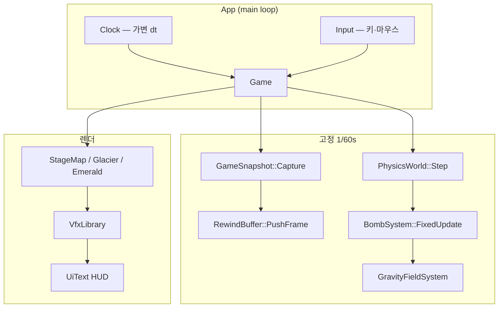

# Chrono Rush — 프로젝트 최종 보고서

> **과목:** [Global] Game Programming  
> **프로젝트명:** Chrono Rush  
> **팀:** NULL Bros.  
> **팀원:** 202304709 · 박효담 / 202304438 · 조현진  
> **제출일:** 2026년 6월 6일

---

## 1. 개요

### 1.1 프로젝트 목표

본 프로젝트 **Chrono Rush**는 Unity·Unreal 등 **상용 게임 엔진 없이**, C++20과 SDL2만으로 2D 러너(Endless Runner)를 구현하는 것을 목표로 한다. 단순 자동 달리기를 넘어 **시간 역행(Rewind)**, **슬로우 모션**, **폭탄·중력장(블랙홀)** 을 하나의 루프에 묶어 “시간을 조작하는 SF 러너”라는 컨셉을 **코드·물리·스냅샷 수준**에서 검증하였다.

과제 요구사항(자체 물리, 고정 timestep, Git 협업)을 만족하면서도, 플레이 테스트를 통해 **조작 수·UI 흐름·스테이지 길이**를 여러 차례 조정하였다(2.6절).

### 1.2 게임 한 줄 소개

플레이어는 자동으로 스크롤되는 맵을 달리며 장애물과 낙하물을 피하고, **폭탄(X)** 으로 길을 열며, **역행(Z)** 과 **슬로우(Shift)** 로 위기를 넘긴다. **2단 점프(C)** 로 Normal·Tall 장애물에 대응하며, HP는 이동 거리에 비례해 감소한다. **Mars → Glacier → Emerald** 3스테이지·총 15km를 완주하면 Clear! 연출과 함께 리더보드에 점수가 기록된다.

### 1.3 개발 환경

| 항목 | 내용 |
|------|------|
| 언어 | C++20 |
| 그래픽·입력 | SDL2 2.30.6 (CMake FetchContent) |
| 빌드 | CMake + Ninja / Visual Studio 2022 |
| 플랫폼 | Windows x64 (MSVC) |
| 버전 관리 | GitHub — `miniherb13/Game-Programming` |
| 에셋 | PNG/JPEG, stb_image 로드, POST_BUILD 시 `assets/` 복사 |
| 해상도 | 1280×720, 60Hz 고정 업데이트 |

**빌드·실행:** 프로젝트 루트에서 `.\build.ps1` (MSVC `vcvars` 자동 설정). `.\build.ps1 -Run` 또는 `build\chrono_rush_demo.exe` 실행.  
**배포:** Release 빌드(`build-release/`)의 exe + `assets/`를 `dist/ChronoRush-play.zip`으로 묶어 배포한다(최신 패키지: 2026-06-06 23:04). 타 PC 실행 시 VC++ Redistributable x64 필요.

### 1.4 팀 구성 및 역할

README **옵션 1** 분담과 실제 Git 커밋·브랜치(`main`, `현진`, `효담`)를 기준으로 역할을 정리하였다.

| 역할 | 담당 | 주요 기여 |
|------|------|-----------|
| **A** | 박효담·조현진 | `Bomb.cpp`, `GravityField.cpp` — 폭탄 투척·바운스·폭발, 블랙홀 힘 모델, `BombSlotSnapshot`/`GravityFieldSnapshot`, `GameSnapshot::Capture`/`Apply` |
| **B** | 박효담 | `RewindBuffer`(180프레임), 스폰·스크롤·난이도 곡선·`PickSpawnPattern`, Shift 슬로우·이중 스태미나, 낙하 장애물, 장애물 8종·아이템·피격·점수·**리더보드·폭탄 쿨다운(0.75s)** |
| **조현진** | 조현진 | Emerald 3스테이지, HUD·타이틀·조작법 2단계 UI, `UiText`·`VfxLibrary`, `build.ps1`, merge·버그 수정 |

| 담당 | 대표 파일 |
|------|-----------|
| 박효담·조현진 | `src/game/Bomb.cpp`, `GravityField.cpp`, `src/rewind/Snapshot.cpp` |
| 박효담 | `src/rewind/RewindBuffer.cpp`, `src/game/Game.cpp`(스폰·슬로우·역행 호출) |
| 조현진 | `StageEmerald.cpp`, `UiText.cpp`, `VfxLibrary.cpp`, `PlayerSprite.cpp`, `build.ps1` |

---

## 2. 게임 기획

### 2.1 컨셉 및 테마

**키워드:** 시간, 시계, 역행, 러너, SF.

플레이어 실루엣과 시계·되감기 화살표를 타이틀·역행 VFX에 사용하였다. 스테이지는 **Mars → Glacier → Emerald** 순으로 환경색·장애물 밀도·낙하 빈도가 증가하며, “행성을 가로지르는 시간 여행 러너”라는 내러티브를 시각적으로 전달한다. 타이틀은 `title_screen_v2.png`를 비율 유지(contain)로 표시하고, 레터박스는 `#080A12` 단색으로 처리하여 워터마크·UI 겹침을 제거하였다.

> **그림 1.** 타이틀 화면 — CHRONO RUSH 로고, “Press SPACE” 안내 *(1280×720 캡처 후 삽입)*

### 2.2 핵심 게임플레이 루프

1. **달리기** — 카메라는 플레이어 X를 화면 좌측(~140px)에 고정하고, `m_distance`·`m_scrollSpeed`로 맵이 스크롤된다.  
2. **장애물 회피** — 2단 점프(C: 지상 1단·공중 1단), 실드(별 아이템 5초), 폭탄으로 Tall 등 일부 장애물 파괴.  
3. **자원 관리** — HP(거리), 슬로우 스태미나(파랑, 최대 1.5), 역행 스태미나(보라).  
4. **시간 조작** — Shift 슬로우(`simDt = dt × 0.35`, H로 홀드/토글 전환), Z 역행(180프레임 ≈ 3초 복원).  
5. **점수·클리어** — 점수 = 거리/10 + 폭탄 처치×50. 15km 클리어 시 Clear! + 폭죽, Game Over·Clear 후 Space로 재시작 또는 타이틀 복귀.

### 2.3 조작법

| 입력 | 동작 |
|------|------|
| **C** | 점프 — 지상 1단(Normal 대응) / 공중 1회 추가 2단(Tall 대응). 코요테 타임·점프 버퍼 적용 |
| **X** 홀드 / 떼기 | 폭탄 충전(`throw_0`→`throw_1`) → 발사(`throw_2`, 0.35초). 마우스 조준, 점선 궤도. **발사 후 0.75초 쿨다운** |
| **Shift** | 슬로우 (기본: 누르는 동안 홀드). 슬로우 스태미나 초당 0.5 소모, 비활성 시 0.25 회복 |
| **H** | 슬로우 입력 방식 전환 — **홀드 ↔ 토글** (재시작 후에도 설정 유지) |
| **Z** | 시간 역행 (역행 스태미나 1.5 소모, 버퍼 180프레임 소진) |
| **Esc** | 일시정지 / 일시정지 중 한 번 더: 종료 |
| **Space** | 타이틀 → 조작법 → 게임 시작 / 일시정지 해제 / Game Over 재시작 / Clear 후 타이틀 |

**아이템:** 번개 = 슬로우 스태미나, 하트 = HP, 별 = 실드(무적 5초, 장애물 Y 밀림 무시).

**피격 무적:** 장애물 충돌 시 Cookie Run 방식으로 **약 1.5초** 무적·깜빡임. 연속 피해를 줄이기 위해 피격 시 캐릭터를 장애물 밖으로 분리한다.

**시작 흐름:** 타이틀(Space) → **인게임 배경 + 조작법 패널**(C→X→Z→Shift 순, Space) → 본 게임. 타이틀 아트와 조작 설명을 분리하여 가독성을 높였다.

> **그림 2.** 인게임 조작법 오버레이 — 맵 위 반투명 패널 *(캡처 후 삽입)*

### 2.4 스테이지 구성

| 스테이지 | 시작 거리 | 길이 | 특징 |
|----------|-----------|------|------|
| **Mars** | 0 m | 5 km | 화성 타일·장애물 8종, 블랙홀 VFX 배경 |
| **Glacier** | 5 km | 5 km | 빙하 테마, **낙하 장애물(유성)** 스폰 시작 |
| **Emerald** | 10 km | 5 km | 에메랄드 테마, 장애물 외곽선 강화, 스폰·낙하 빈도 **점진적 상승**(초반 급격 난이도 완화) |
| **클리어** | 15 km | — | Clear! 연출, Space로 타이틀 복귀 |

스테이지 전환 시 페이드·`Stage 2` / `Stage 3` 알림 UI가 표시된다. 각 스테이지는 `StageMap` / `StageGlacier` / `StageEmerald` 클래스가 타일·패럴랙스·데코를 담당한다.

> **그림 3.** Mars / Glacier / Emerald 인게임 화면 각 1장 *(3열 배치 권장)*

### 2.5 장애물·아이템·점수

- **장애물 8종:** Normal, Tall, Bounce, Spike, Triangle, Ceiling, Moving, **Falling(낙하)**  
- Tall 등 일부는 폭탄 폭발 반경(약 95px) 안에서 파괴 가능.  
- 스프라이트는 스테이지별 PNG; `SpriteOutline`으로 흰 테두리 bake. **Emerald 장애물**은 ExtraBold 외곽선으로 녹색 배경에서도 식별성을 확보하였다.  
- **HP:** 이동 거리에 따라 감소. 생존 가능 거리 ≈ 맵 길이의 150% (`kHpSurvivalDistanceM`).  
- **리더보드:** exe 기준 경로(`SDL_GetBasePath`)의 `scores.txt`에 점수·거리·폭탄 킬 저장, 상위 10개. Game Over·Clear 화면에 `[ TOP 10 ]` 패널 표시.

### 2.6 기획 변경 사항

개발 중 컨셉·UX를 아래와 같이 조정하였다. **실패가 아니라 플레이 테스트·구현 비용을 반영한 개선**이다.

| 변경 항목 | 초기 방향 | 최종 방향 | 변경 이유 |
|-----------|-----------|-----------|-----------|
| 중력장 | V키 수동 배치 (인력/척력) | **폭탄 폭발 시 블랙홀** | 조작 수 과다 → “폭탄=공격+블랙홀” 통합 |
| 역행 스태미나 | 단일 스태미나 | **슬로우(파랑) / 역행(보라) 분리** | F·Z 동시 남용 방지, HUD 가독성 |
| 슬로우 | 미구현 | **Shift(홀드) + H(토글 전환) + simDt 통일** | 물리·스폰·HP·스태미나가 동일 시간 스케일 |
| 점프 | 단일 점프 | **2단 점프**(지상=Normal / 공중 1회=Tall) | 장애물 높이 차에 맞춘 회피 깊이 |
| 시작 UI | 타이틀에 조작법 동시 표시 | **타이틀 → 인게임 조작법** | 타이틀 아트·맵 미리보기 분리 |
| 클리어 | 10km 즉시 재시작 | **15km Clear! + Space 타이틀** | 3스테이지×5km 구조 |
| 실드 연출 | 노란 사각 테두리 | **타원 궤도 파티클 20개** | 시인성·테마 통일 |
| 폭탄 연사 | 제한 없음 | **실제 발사 후 0.75초 쿨다운** | 블랙홀·점수 남용 방지, X만 눌렀을 때는 쿨 미적용 |
| 클리어 후 기록 | 없음 | **로컬 리더보드 TOP 10** | 재도전 동기 *(박효담)* |
| 2스테이지 이후 | 지상 장애물만 | **Glacier부터 낙하 장애물** | 난이도 곡선·긴장감 *(박효담)* |
| 슬로우 키 | F | **Shift** | WASD 인접 키와의 오입력 감소 |
| Game Over 재시작 | FixedUpdate만 처리 | **HandleInput에서 Space 우선 처리** | 오버레이 중 입력 누락 방지 |

### 2.7 플레이 테스트 피드백 및 개선

내부·외부 플레이 테스트(2026년 6월)에서 수집한 의견을 바탕으로 UX·난이도·안정성을 조정하였다. 표현은 제출용으로 순화하였으며, **“버그 수정”과 “기획·밸런스 개선”을 구분**하여 기록한다.

| # | 테스트 피드백 (요약) | 원인·분석 | 개선 내용 | 담당 |
|---|---------------------|-----------|-----------|------|
| 1 | Game Over·Clear에서 **Space 입력이 반응하지 않음** | 오버레이 상태에서 재시작 입력이 고정 업데이트 쪽에서만 처리됨 | `HandleInput`에서 Space를 우선 처리; 오버레이 중 불필요 입력 pending 제거 | 조현진 |
| 2 | **X만 눌러도** 폭탄이 쿨다운됨 | 쿨다운을 “키 입력” 기준으로 적용 | `UpdateThrow`가 **실제 발사 성공 시에만** 쿨 적용; 간격 **0.75초** | 박효담·조현진 |
| 3 | 슬로우 키(F)가 이동 키와 겹침 | 초기 키 배치 | **Shift**로 변경, **H**로 홀드/토글 전환 | 조현진 |
| 4 | H로 모드만 바꿨는데 슬로우가 켜짐 | Shift pending이 Hold 모드에서 소비되지 않음 | H 입력 시 pending 초기화, 프레임 종료 시 `slowPending` 정리 | 조현진 |
| 5 | Tall 장애물 대응 점프가 어려움 | 단일 점프 높이 한계 | **2단 점프** 도입, 역행 스냅샷에 `airJumpsLeft` 저장 | 조현진 |
| 6 | 특정 구간 **난이도가 급격히 상승** | Tall·천장·낙하물 연속 패턴, Emerald 간격 | `PickSpawnPattern` 필터·가중치, Emerald 스폰 해금 거리·간격 완화, 낙하 동시 1개 | 박효담·조현진 |
| 7 | **맵 타일 이음새**가 보임 | 스크롤 좌표와 장식 `kWorldOffsetX` 불일치, 1px 갭 | 타일 가로·세로 +1px 오버랩, 스테이지 2·3 지형 scroll 보정, 패럴랙스 +2px | 조현진 |
| 8 | Emerald 장애물이 배경과 구분 어려움 | 녹색 톤과 스프라이트 유사 | Emerald 전용 **ExtraBold 흰 외곽선** bake | 조현진 |
| 9 | Clear·Game Over **UI 겹침** | 결과 텍스트와 리더보드 패널 수직 배치 미흡 | 메인 패널 / 리더보드 / Space 안내 **3단 분리**, 전체 높이 기준 중앙 정렬 | 조현진 |
| 10 | 조작법 순서가 직관적이지 않음 | 항목 나열 순서 | 인게임 패널·README를 **C→X→Z→Shift→…** 순으로 통일 | 조현진 |
| 11 | 장애물에 닿으면 **HP가 연속 감소** | 접촉 상태 유지 + 무적 시간 짧음 | Cookie Run식 **1.5초 무적·깜빡임**, 피격 시 분리·넉백 | 조현진 |
| 12 | 재시작 후 의도치 않은 점프·역행 | Game Over 중 입력 pending 잔류 | 오버레이 구간 `ClearGameplayPending()` | 조현진 |

> **배포:** 위 개선을 반영한 **Release 빌드**·에셋은 `dist/ChronoRush/` 및 `dist/ChronoRush-play.zip`(2026-06-06 23:04, `build-release/` 기준)으로 패키징하였다. 팀원 B가 제출한 개별 초안(`docs/final-report-박효담-최종.docx`)의 4.3절 상세 기술을 본문에 통합·최신 스펙으로 정리하였다.

## 3. 시스템 구조

### 3.1 전체 아키텍처

SDL2 윈도우와 가변 `dt` 루프 위에, 게임 규칙은 **60Hz 고정 timestep**으로만 진행한다. 역행은 매 고정 프레임마다 `GameSnapshot`을 링 버퍼에 쌓고, Z 입력 시 180프레임을 역순으로 `Pop`하여 복원한다.



> **그림 4.** 시스템 블록 다이어그램 — 위 mermaid를 draw.io/PPT로 옮겨 PNG 삽입 권장

**텍스트 요약:**

```
main.cpp → App (SDL, 메인 루프)
  ├─ Clock, Input
  └─ Game
       ├─ PhysicsWorld      — 고정 timestep, 원-원 충돌
       ├─ RewindBuffer      — GameSnapshot × 180
       ├─ BombSystem / GravityFieldSystem
       ├─ StageMap / StageGlacier / StageEmerald
       └─ VfxLibrary / UiText / PlayerSprite …
```

### 3.2 디렉터리 구조

| 경로 | 역할 |
|------|------|
| `src/app/` | `App.cpp` — 윈도우·메인 루프·고정 dt 누적 |
| `src/core/` | Clock, Input, Log |
| `src/physics/` | PhysicsWorld, Body (Kinematic/Dynamic/Static) |
| `src/rewind/` | BodySnapshot, Snapshot, RewindBuffer |
| `src/game/` | Game, Bomb, GravityField, Stage*, Sprites |
| `src/render/` | UiText(GDI 한글), VfxLibrary, SpriteOutline |
| `assets/` | player, stages, items, vfx, title |
| `docs/` | snapshot-agreement, 보고서, team-b-tasks |

### 3.3 게임 루프

`App::Run`에서 매 프레임:

1. **입력** — `Input::Pump` → `Game::HandleInput` (슬로우 모드·역행 큐·폭탄 충전, 오버레이 Space 처리)  
2. **고정 업데이트** — `IsGameplayActive()`일 때 `acc += dt`, `while (acc >= 1/60)` → `FixedUpdate`  
3. **가변 업데이트** — `UpdateVisualEffects` (역행 VFX, 블랙홀 파티클, 실드 오라 위상)  
4. **렌더** — 배경·스테이지 → 오브젝트 → HUD → 오버레이(일시정지·조작법·Clear·GameOver·리더보드)

슬로우 활성 시 `simDt = dt × 0.35`로 물리·스폰·HP 감소·스태미나 소모·폭탄 쿨다운을 **동일 스케일**로 처리하여 “느려진 세계”가 일관되게 느껴지도록 하였다.

### 3.4 스냅샷·역행 데이터 흐름

```
FixedUpdate (매 1/60s)
  GameSnapshot::Capture(플레이어, jumpBuffer·coyote·airJumpsLeft, 폭탄×16, 중력장×6, 상자×96, HP·스태미나…)
  RewindBuffer::PushFrame

Z + 역행 스태미나 ≥ 1.5 + 쿨다운 없음 + 버퍼 충분
  180 × PopFrame → GameSnapshot::Apply
  0.5s freeze, 2s 무적, 슬로우 해제, 역행 VFX
```

`docs/snapshot-agreement.md`에 **BodySnapshot 공통 필드**, **고정 슬롯 ID(폭탄 16·필드 6)**, **“해당 프레임 그대로 복원”** 규칙을 문서화하여 A·B가 병렬 작업할 수 있었다.

---

## 4. 핵심 기술 구현

### 4.1 시간 역행 시스템 `[담당: 박효담]`

#### 4.1.1 RewindBuffer

- **용량:** 180프레임 ≈ **3초** (고정 60Hz)  
- **구조:** 원형 버퍼 `m_storage`, `PushFrame`은 head 전진, `PopFrame`은 최신 프레임부터 역순 소비  
- **단위:** 프레임마다 `GameSnapshot` 전체 (플레이어·폭탄·필드·상자·HP 등)

```cpp
// RewindBuffer.cpp — 링 버퍼 Push (요약)
void RewindBuffer::PushFrame(const GameSnapshot& frame) {
  m_storage[m_head] = frame;
  m_head = (m_head + 1) % m_capacity;
  if (m_size < m_capacity) m_size++;
}
```

#### 4.1.2 복원 규칙

- 해당 프레임에 저장된 상태를 **그대로** 복원한다.  
- 폭발·블랙홀 생성 **이후** 역행하면, 그 **이전** 스냅샷 기준으로 폭탄·필드가 **취소**된다.  
- 폭탄·중력장은 **고정 슬롯 인덱스**(0..15, 0..5)로 풀링 bodyId와 스냅샷이 1:1 대응한다.

#### 4.1.3 게임플레이 연동

| 항목 | 값·동작 |
|------|---------|
| 역행 스태미나 소모 | 1.5 (`kRewindStaminaCost`) |
| 쿨다운 | 역행 직후 1.5 (동일량) |
| 역행 성공 시 | 0.5s freeze, 2s 무적, 슬로우 해제 |
| 실패 | 스태미나·버퍼·쿨다운 부족 시 포즈·VFX 없음 |
| 입력 | 프레임당 1회 소비 (`Input` 소비 규칙) |

#### 4.1.4 역행 VFX `[조현진]`

- **Ghost:** 과거 위치에 달리기 스프라이트 + 파란 tint (어두운 사각 아티팩트 제거)  
- **수렴 파티클** 340 + **링** 200 + **스파크** 220, 총 1.4초 fade in/out  
- 비네트 corner 검은 사각 제거, 화면 중앙 고정 포즈 제거 → **실제 플레이어 좌표**에 연출

> **그림 5.** Z 사용 직후 — 유령·소용돌이·비네트 *(캡처 후 삽입)*

```cpp
// Game.cpp — 역행 성공 시 (요약)
if (any) {
  m_snapshotScratch.Apply(...);
  m_staminaRewind = std::max(0.0f, staminaBeforeRewind - kRewindStaminaCost);
  SpawnRewindVfx(rewoundPlayer.pos);
  m_rewindFreezeLeft = kRewindFreezeSeconds;  // 0.5f
  m_hitCooldown = kRewindInvincibleTime;      // 2.0f
}
```

---

### 4.2 폭탄 및 중력장(블랙홀) `[담당: 박효담·조현진]`

#### 4.2.1 폭탄

- **X 홀드:** 충전(`throw_0`→`throw_1`, 최대 1.2초), **X 떼기:** 발사(`throw_2` 0.35초)  
- **조준:** 마우스 방향, `BombTuning::trajectory*` 점선 궤도(60Hz 시뮬레이션 200스텝)  
- **물리:** Dynamic Body, restitution 0.32, 마찰·바닥 마찰, 장애물 충돌  
- **폭발:** 퓨즈/충돌 → 반경 ~95px, 장애물·낙하물 파괴, 점수 +50  
- **쿨다운:** 실제 발사 성공 후 **0.75초** (`kBombCooldownSeconds`). X 탭만으로는 쿨 미적용.

#### 4.2.2 중력장(블랙홀)

- **트리거:** `GravityFieldSystem::SpawnFromExplosion` — 폭탄 폭발 시  
- **힘:** 거리² 반비례 `strengthK`, `minDistSq`·`maxForce` 클램프  
- **지속:** 약 1.25초, 최대 6개 동시  
- **연출:** `VfxLibrary::DrawBlackHole` — accretion ring, shockwave, ember sheet

> **그림 6.** 폭탄 점선 궤도 + 폭발 후 블랙홀 *(캡처 후 삽입)*

#### 4.2.3 스냅샷 필드 (박효담·조현진)

**BombSlotSnapshot** (`include/game/Bomb.h`):

| 필드 | 설명 |
|------|------|
| `physics` | `BodySnapshot` — pos, vel, onGround, active |
| `phase` | Inactive / Flying / Exploded |
| `fuseLeft` | 폭발까지 남은 시간 |
| `visualLeft` | 폭발 연출 타이머 |
| `explosionCenter` | 폭발 중심 (역행 시 복원) |
| `wasOnGround`, `prevVelY` | 바운스·착지 판정 보조 |

**GravityFieldSnapshot:**

| 필드 | 설명 |
|------|------|
| `active`, `mode` | Attract / Repel |
| `center`, `radius`, `timeLeft` | 필드 형상·수명 |
| `spinAngle`, `affects*` | 연출·적용 대상 플래그 |

`GameSnapshot::Capture` / `Apply`에서 폭탄 16슬롯·필드 6슬롯·상자 `props[]`를 일괄 저장·복원한다.

---

### 4.3 물리·러너·스테이지 `[담당: B + 조현진]`

#### 4.3.1 PhysicsWorld

- **MotionType:** Player = **Kinematic** (`lockVelX`), 폭탄 = Dynamic, 장애물 = Static/Dynamic  
- **충돌:** Dynamic끼리 탄성 반응; Player–Obstacle은 **Y만 분리** (러너 X 스크롤 유지)  
- **실드:** `Body::ignoreObstacleContact` — 무적 중 장애물 Y 밀림·`PreventPlayerObstacleClimb` 스킵으로 “벽에 붙어 즉시 착지” 버그 방지

#### 4.3.2 러너·스폰 `[B]`

- 플레이어 화면 X 고정, `m_distance`·`m_scrollSpeed` 증가 (`240 + elapsed × 1.5`)  
- `UpdateSpawn` — 패턴 0~7 기반 장애물·아이템 스폰  
- **`PickSpawnPattern`** — Tall·천장 연속 패턴 필터, Emerald 초반 패턴 해금 완화, 폭탄 쿨 중 Tall 패턴 제외 (2.7절 #6)  
- Glacier(5km~) **낙하 장애물**(동시 최대 1개), Emerald는 **점진적 패턴 해금·간격 완화**  
- **오브젝트 풀링:** 카메라 밖 장애물 `active = false` 재활용 (`m_obstacles`, `m_fallingIds`, `m_propIds`)

#### 4.3.3 UI·타이틀·리더보드 `[조현진 + B]`

- **UiText:** Windows GDI **맑은 고딕** — 한글 HUD·팝업·스테이지 알림  
- **HUD:** Cookie Run 스타일 HP·슬로우/역행 스태미나·거리·점수·경과 시간  
- **타이틀:** `title_screen_v2.png`, contain 렌더, `#080A12` 배경  
- **실드:** 노란 타원 궤도 **파티클 20개**, `m_shieldOrbitPhase` 회전  
- **리더보드:** exe 경로(`SDL_GetBasePath`) 기준 `scores.txt`, Game Over·Clear **패널 분리** UI (2.7절 #9)

#### 4.3.4 장애물 시스템 `[B]`

- **8종:** Normal(낮은 상자), Tall(높은 상자·폭탄 파괴), Bounce, Spike(피해 0.4), Triangle(0.35), Ceiling, Moving(사인파), Falling(낙하·운석 트레일)  
- **스테이지별 난이도:**  
  - Mars(0~5km): 간격 160~220px, 패턴 0~4 점진 해금  
  - Glacier(5~10km): 간격 120~180px, 패턴 0~7, 낙하 간격 4~8초(경과에 따라 단축)  
  - Emerald(10~15km): 간격 130~200px, 패턴 3→7 **거리별 해금**, `PickSpawnPattern` 가중치·필터로 초반 급격 상승 완화  
- **낙하물:** Glacier부터 스폰, Emerald 구간에서도 **동시 1개** 제한

#### 4.3.5 아이템 시스템 `[B]`

- **3종:** 하트(+HP 0.3), 번개(+슬로우/역행 스태미나), 별(실드 5초). SDL2 선 그리기(`DrawHeart`/`DrawLightning`/`DrawStar`)  
- **랜덤 스폰:** 스폰 지점마다 40% 확률, 종류 비율 HP 40% / 스태미나 30% / 실드 30%  
- **자석:** 플레이어 110px 이내 접근 시 거리² 비례 pull(`kItemMagnetPullSpeed = 95`)  
- **수집 피드백:** 색상별 파티클 6개 + `+HP` / `+STAMINA` / `+SHIELD` 팝업

#### 4.3.6 피격 반응 및 시각 효과 `[B + 조현진]`

- **피격:** 빨간 화면 오버레이(0.4s), 파티클 8개, 피해량 장애물별 차등(Spike 0.4, Normal/Ceiling 0.25~0.3 등)  
- **무적:** Cookie Run식 **1.5초**(`kHitInvincibleTime`), **16Hz 깜빡임**, 피격 시 장애물 밖 **분리·넉백** (2.7절 #11)  
- **폭발 충격파:** 반경 95px 내 장애물에 방향별 힘(`800/dist`), `linearDamping = 0.1`  
- **파티클:** `SpawnParticles`, 중력 400, 최대 6500개  
- **스테이지 알림:** Stage 1/2/3 텍스트 3초 페이드 (5000m·10000m 전환)

#### 4.3.7 슬로우모션 시스템 `[B]`

- **Shift** 홀드(기본) 또는 **H**로 토글 모드 전환 — `simDt = dt × 0.35`로 물리·스크롤·HP·스태미나·폭탄 타이머 통일  
- 슬로우 스태미나 최대 1.5, 활성 시 초당 0.5 소모, 비활성 시 0.25 회복  
- HUD 스태미나 바 **좌(파랑)=슬로우 / 우(보라)=역행** 분리

#### 4.3.8 점수·리더보드 시스템 `[B]`

- **점수:** `(distance / 10) + bombKill × 50`  
- **리더보드:** Game Over·Clear 시 `SubmitScore()`, exe 경로 `scores.txt`에 상위 10개 저장·표시  
- **폭탄 쿨다운:** `UpdateThrow` **실제 발사 성공 시에만** 0.75초 적용 (2.7절 #2)

> **그림 7.** HUD + 실드 오라 + 거리 표시 *(캡처 후 삽입)*

---

## 5. 협업 및 설계 의사결정

### 5.1 사전 합의 (`docs/snapshot-agreement.md`)

1. **공통 포맷:** `BodySnapshot` — active, pos, vel, onGround  
2. **ID 정책:** 폭탄·중력장·상자 **고정 슬롯 인덱스**  
3. **역행 규칙:** 저장된 프레임 그대로 복원 (폭발·필드 취소 포함)  

A(폭탄·스냅샷)가 **필드·Capture/Apply**, B(박효담)가 **RewindBuffer·호출 타이밍·스태미나 UI**를 담당하는 분업이었다. 합의 문서 없이는 “폭발 후 역행 시 블랙홀이 남는지” 같은 엣지 케이스에서 충돌이 빈번했을 것으로 판단한다.

### 5.2 Git 협업

- **브랜치:** `main`(통합), `현진`·`효담`(기능별 작업) → merge 후 `origin/현진` push  
- **대표 merge:** 슬로우·스태미나 분리, Emerald 3스테이지, 타이틀·실드·역행 VFX, 리더보드, 플레이 테스트 반영, **박효담 B 담당 보고서 섹션 통합**  
- **배포 패키지:** `dist/ChronoRush-play.zip` — Release 빌드 최신본(2026-06-06 23:04)  
- **빌드 통일:** `build.ps1` / `build.cmd` — MSVC `vcvars` 자동, Ninja  
- **충돌 회피:** A는 `Bomb`/`GravityField`/`Snapshot`, B는 `Game` 스폰·역행 분기, 조현진은 Stage·render·merge

### 5.3 기술적 트레이드오프

| 결정 | 이유 |
|------|------|
| 플레이어 X = 스크롤 속도 | 러너 레인 고정, 장애물은 Y 위주 |
| SDL2 static link | 배포 시 SDL2.dll 불필요 |
| stb_image + SDL 텍스처 | 의존성 최소, PNG/JPEG 혼용 |
| `Game.cpp` 집중 | 초기 속도 우선; 향후 SpawnManager·RewindFacade 분리 예정 |
| 로컬 `scores.txt` | 서버 없이 리더보드; exe와 같은 폴더에 생성 |

---

## 6. 개발 과정 및 문제 해결

| # | 문제 | 원인 | 해결 | 담당 |
|---|------|------|------|------|
| 1 | 타이틀 로드 후 즉시 종료 | `stbi_image_free` 후 surface가 참조한 메모리 UAF | 픽셀 `vector` 복사 후 GPU 업로드 | 조현진 |
| 2 | 실드 중 장애물 접촉 시 즉시 착지 | Y 밀기 + 충돌만 면역 | `ignoreObstacleContact`, climb 방지 스킵 | 조현진 |
| 3 | 역행 시 캐릭터 자리 검은 사각 | Ghost tint + 비네트 corner | tint 수정, corner 제거 | 조현진 |
| 4 | 역행 연발·스태미나 오류 | 입력·스냅샷 타이밍 | 1회 소비, 슬로우/역행 스태미나 분리 | 박효담 |
| 5 | 스프라이트 안 보임 | GPU upload가 Draw 조건 뒤 | `EnsureUploaded()` 선행 | 조현진 |
| 6 | 슬로우 중 HP·스폰 불일치 | 가변 dt만 감속 | `simDt = dt × 0.35` 통일 | 박효담 |
| 7 | 폭탄·블랙홀 스팸 | 쿨다운 없음 | 실제 발사 후 0.75초 쿨, 미발사 시 미적용 | 박효담·조현진 |
| 8 | CMake 캐시 경로 오류 | 다른 PC 절대경로 잔존 | `build/` 삭제 후 재configure | 조현진 |
| 9 | Game Over Space 무반응 | 입력 처리 순서 | `HandleInput`에서 재시작·타이틀 처리 | 조현진 |
| 10 | H 전환 시 슬로우 오동작 | `slowPending` 잔류 | H·프레임 종료 시 pending 정리 | 조현진 |
| 11 | UI·리더보드 겹침 | 패널 레이아웃 | 3단 분리·세로 중앙 정렬 | 조현진 |
| 12 | 피격 HP 연속 감소 | 접촉 유지 | 1.5s 무적·분리, Cookie Run식 깜빡임 | 조현진 |
| 13 | Emerald 가시성·난이도 | 배경색·스폰 | ExtraBold 외곽선, 패턴 필터·간격 조정 | 조현진 |
| 14 | 맵 타일 틈 | scroll·오버랩 | offset 보정, +1~+2px 오버랩 | 조현진 |

*상세 피드백·대응 매핑은 **2.7절** 참조.*

---

## 7. 결과 및 평가

### 7.1 구현 완료 기능

| 기능 | 상태 |
|------|------|
| SDL2 윈도우·60Hz 고정 업데이트 | ✅ |
| 3스테이지·15km·Clear! 연출 | ✅ |
| 폭탄·블랙홀·0.75s 쿨다운(발사 시만) | ✅ |
| 시간 역행(3초)·GameSnapshot·2단 점프 스냅샷 | ✅ |
| Shift 슬로우·H 홀드/토글·이중 스태미나 | ✅ |
| 2단 점프·Cookie Run식 피격 무적(1.5s) | ✅ |
| HUD·한글 UI·타이틀·2단계 시작·조작법 순서 정리 | ✅ |
| Game Over·Clear UI 분리·리더보드 TOP 10 | ✅ |
| Emerald 장애물 외곽선·스폰 밸런스 조정 | ✅ |
| Git 협업·CMake·배포 zip (`dist/ChronoRush-play.zip`, 2026-06-06 23:04) | ✅ |
| 장애물 8종·낙하물·아이템 3종·피격·점수·리더보드 (B 담당) | ✅ |

### 7.2 시연

- **로컬 실행:** `.\build.ps1 -Run` 또는 **`dist/ChronoRush-play.zip`**(Release 2026-06-06 23:04) 압축 해제 후 exe 실행  
- **LMS 제출:** 과제 안내에 따라 **최종 보고서 PDF** 제출(본 과제는 별도 플레이 영상 제출 없음)

> **그림 8.** Clear! 연출 또는 Game Over + 리더보드 *(캡처 후 삽입)*

### 7.3 한계 및 향후 계획

- **사운드 BGM/SFX** 미구현 — 역행·폭발·피격에 SFX 우선 적용 예정  
- **15km 클리어 시간·HP 감소율** — 플레이 테스트 1·2차 반영 후에도 Emerald 후반 미세 조정 여지  
- **맵 타일** — PNG·스케일 한계로 완전 제거는 어려우나, 코드 측 정렬·오버랩으로 개선(2.7절 #7)  
- **`Game.cpp` 비대** — SpawnManager, RewindFacade 모듈 분리  
- **에셋 용량** — PNG 비압축 대용량(~100MB); 배포용 WebP/텍스처 아틀라스 검토  
- **멀티플랫폼** — 현재 Windows MSVC 전용; Linux/macOS는 빌드 스크립트 추가 필요  

---

## 8. 결론

Chrono Rush는 **SDL2 + 자체 2D 물리**만으로 러너와 **시간 조작(역행·슬로우)** 을 구현하였다. **프레임 단위 `GameSnapshot`**과 **폭탄–블랙홀 연동**은 상용 엔진 없이도 폭발·역행·슬로우가 동시에 일관되게 동작함을 보여 준다.

**박효담·조현진**과 **`snapshot-agreement` 사전 합의** 후 병렬 개발한 경험이, “폭발 후 Z로 되감기” 같은 엣지 케이스를 안정적으로 처리하는 데 핵심이었다. **플레이 테스트(2.7절)** 를 통해 조작·UI·난이도·입력 안정성을 순차 개선하였고, B 담당 기술 섹션(4.1·4.3)과 UI·3스테이지·VFX 통합을 거쳐 **외부 배포 가능한 데모**(`ChronoRush-play.zip`, Release 2026-06-06 23:04)까지 완성하였다. 사운드·후반 밸런스·코드 모듈화는 후속 과제로 남긴다.

---

## 참고

- 저장소: https://github.com/miniherb13/Game-Programming  
- `README.md`, `docs/snapshot-agreement.md`, `docs/team-b-tasks.md`, `docs/report-writing-guide.md`, `docs/final-report-박효담-최종.docx`  
- SDL2: https://wiki.libsdl.org/

---

## 부록 A. PDF 제출 전 체크리스트

- [ ] 표지 — **NULL Bros.**, 팀원 **학번·실명** 기입 *(본문 상단에 반영됨)*  
- [ ] 그림 1~8 — 캡처 삽입 (`Win+Shift+S`, 1280×720)  
- [ ] A4, 10~11pt, **6~8쪽** (부록·체크리스트는 PDF에서 삭제 가능)  
- [ ] Word/PDF export → LMS 업로드  

---

*문서 버전: 2026-06-06 — 4차 본문 (NULL Bros., 팀원 학번 반영, B 섹션 통합, 조현진). 캡처는 PDF 직전에 삽입.*
